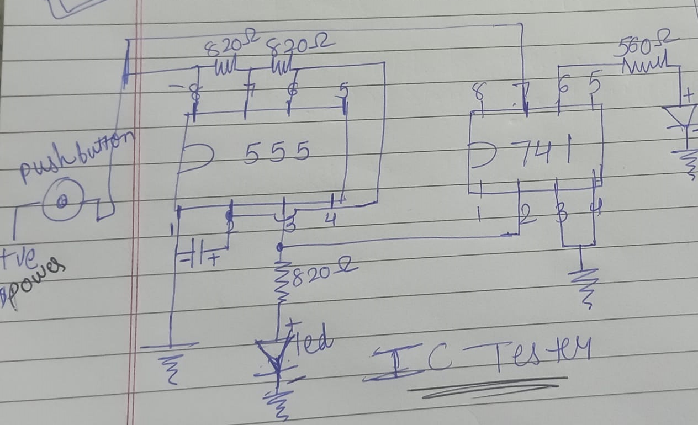
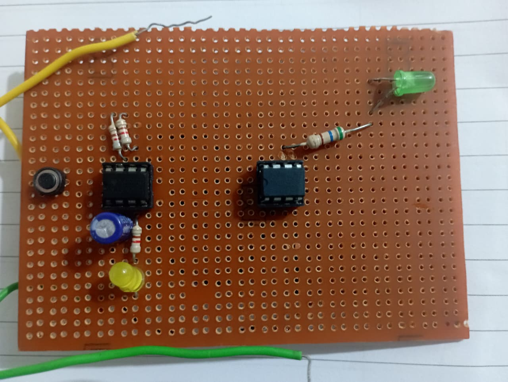

# 🔍 IC 555 & IC 741 Tester Project

This is a simple and effective hardware-based tester circuit designed to verify the functionality of two widely used integrated circuits:
- **IC 555 Timer**
- **IC 741 Operational Amplifier**

The tester uses two IC sockets to allow quick insertion and removal of the target ICs. The result is shown via a blinking **LED indicator**.

---

## ⚙️ How It Works

### ✅ IC 555 Test (Astable Mode)
- When a working **IC 555** is inserted into its socket, it is configured to run in **astable (oscillator)** mode.
- This generates a **square wave** at **pin 3 (output)**.
- The square wave is then used as an input signal for the 741 comparator.

### ✅ IC 741 Test (Comparator Mode)
- The **IC 741 op-amp** is configured in **comparator** mode.
- It compares the incoming pulse from the 555 (connected to the **non-inverting input**) against a fixed voltage or GND on the inverting input.
- If the 741 is functional, it outputs a corresponding pulse that drives an **LED** through a current-limiting resistor.

### 🟢 Test Result
| ICs Status       | LED Behavior |
|------------------|--------------|
| Both working     | LED blinks   |
| 555 faulty       | LED stays OFF (no input to 741) |
| 741 faulty       | LED stays OFF (no output from 741) |

---

## 🔧 Components Used

| Component       | Quantity |
|----------------|----------|
| IC 555 Timer    | 1        |
| IC 741 Op-Amp   | 1        |
| IC Holders      | 2        |
| LED             | 1        |
| Resistors       | 560Ω, 820Ω, 820Ω, 820kΩ |
| Capacitor       | 220μF    |
| Breadboard / PCB| 1        |
| 9V Battery      | 1        |

---

## 🔌 Circuit Diagram

> 
---

## 🧪 Tinkercad Simulation

You can simulate the working version of this tester circuit on Tinkercad here:

🔗 [Tinkercad Simulation Link](https://www.tinkercad.com/things/0mU2DtOJH1I-ic-tester?sharecode=SG6x4rKjeU6QPiGhWSwHW6gFNssjO1_B3aV6SXxGBAc

---

## 📚 Applications

- Quickly test if ICs are working before using them in real circuits
- Great for electronics labs, students, or DIY enthusiasts
- Useful as a demonstration of basic IC functionality and behavior

---

## 🛠️ Future Improvements

- Add test sockets for other common ICs (e.g., 7400 series)
- Include buzzer indicator along with LED
- 

---

---

## 🔩 Permanent PCB Version

This project was also built on a **custom PCB** with all components permanently soldered. It improves durability and portability for practical use.

### 🛠️ Tools & Process:
- Universal PCB or custom layout
- Soldering iron and flux
- Wired based on the same circuit diagram
- Verified working using actual ICs

### 📷 Real Build Photos

| Front View                    
|-------------------------------
|    

---

## 💡 Why This Matters

Unlike simulations or breadboards, a soldered PCB:
- Is **more reliable** for repeated IC testing
- Can be used as a **lab tool**
- Demonstrates **real hardware skills**

---

*Created by Monika Bhanav 
*Feel free to fork, share, or contribute!*
